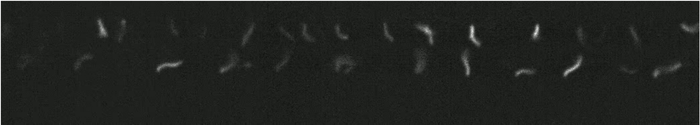
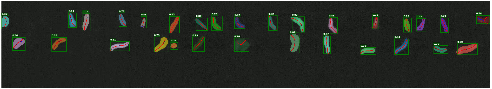

# Cilia.io: Computer vision and machine learning reveal spatial patterns of cilia beating dynamics in the spinal cord

## Overview
Cilia.io is a state-of-the-art ML-based quantification methodology for cilia mophodynamics. This repository contains a complete multi-modal pipeline for quantifying ciliary motion from confocal microscopy videos. This workflow relies on single-shot cilia detection using a fine-tuned YOLO v11 model which identifies bounding box regions of interest (ROI) to pass to Meta's Segment Anything (SAM) vision transformer models, removing the need for computationally expensive iterative masking and tracking. Unlike prior work which use traditional computer vision approaches like binary thresholding and Canny detection, Cilia.io semantically identifies where cilia are, enabling high quality masks even when cilia overlap. The goal of this project is to enable fast, robust, automated analysis of cilia dynamics overtime across diverse experimental conditions. Cilia.io can detect subtle changes in cilia morphodynamics that may not be detected by the human eye, but are pivotal to developing our understanding of ciliary function overall.

<div align="center">
  
  <p><b>Raw Frame:</b> 4-day-post-fertilization zebrafish cilia in the central canal raw confocal image.</p>

  
  <p><b>Cilia.io Frame:</b> High quality detection, segmentation, skeletonization, and quantification of cilia.</p>
</div>

## Authors and Contact Information
**Authors:** Ece Atayeter<sup>1,2</sup>, Jason Ho<sup>3</sup>, Talon G. Blottin<sup>2</sup>, Ilyena B. Joe<sup>2</sup>, Ron Sistrunk<sup>2</sup>, Bo Zhang<sup>4</sup>, Lilianna Solnica Krezel<sup>4</sup>, Andreas Gerstlauer<sup>3</sup>, John B. Wallingford<sup>1</sup>, and Ryan S. Gray<sup>2,5</sup> 

<sup>1</sup>Department of Molecular Biosciences, The University of Texas at Austin, Austin, Texas 78712, USA. \
<sup>2</sup>Department of Nutrition and Pediatrics, Dell Pediatric Research Institute, The University of Texas at Austin, Austin, TX 78723, USA. \
<sup>3</sup>Chandra Family Department of Electrical and Computer Engineering, The University of Texas at Austin, Austin, Texas 78712, USA.\
<sup>4</sup>Department of Developmental Biology, Washington University School of Medicine, S Euclid Avenue, St. Louis, MO 63110, USA. \
<sup>5</sup>**Lead Contact Email:** ryan.gray@austin.utexas.edu \
**Direct all coding questions to:** jason_ho@utexas.edu

## Cilia.io's Core Pipeline

1. **Detection**  
   Cilia are detected frame-by-frame using a fine-tuned **YOLOv11m** model from Ultralytics, trained on 32,167 manually labeled zebrafish monocilia.

2. **Tracking**  
   Object tracks are initialized and maintained using **ByteTrack** with additional logic for **center-distance matching** and **overlap-based ID merging**. Fallback heuristics handle missed detections and ensure temporal ID consistency across frames.

3. **Skeletonization**  
   Segmentation masks are skeletonized using the morphological thinning algorithm, which iteratively removes pixels on each side of the mask until one pixel remains.

4. **Quantification**  
   Tracked trajectories are analyzed to extract per-cilium motion features, including spatial amplitude, beating frequency, beating regularity, centroid frequency, and more. Summary statistics are aggregated across videos for downstream analysis.

5. **Visualization**  
   The pipeline supports trajectory overlays, segmentation mask overlays on the raw confocal videos, skeleton tracking, and bounding box tracking.

## Directory Structure
- **data/**: This is where the data goes
- **sam/**: If coming from github, download the SAM ViT-H checkpoint 4b8939.pth file from Meta
- **src/**: Contains all of the source file pertaining to Cilia.io'
  
  - **analyze_csv_data_violin.py**: Uses the cilia_io output CSVs to generate Welch t-tests, 3D graphics, Cohen's power analysis, and violin plots.
  - **benchmarking_cilia_tools.py**: Benchmarks cilia.io versus other cilia-based segmentation tools from prior literature.
  - **cilia_io.py**: The top main file for the entire repository.
  - **compare_csv_for_accuracy.py**: Script used for calculating the MAPE between manual and cilia.io quantification outputs.
  - **create_yolo_training_dataset.py**: From raw label-studio projects, generates the combined train, validation, and test splits for the fine-tuning of the YOLO model.
  - **ml_helpers.py**: Helper functions used by Cilia.io for machine learning.
  - **quantification_help.py**: Helper functions used by Cilia.io for quantification.
  
- **yolo/**: Contains the original Ultralytics Yolov11m model, the train and test scripts, as well as the final, fine-tuned model.
  - **configs.yaml**: YAML file for configuring the fine-tuning of the YOLO model.
  - **save_trainig_curves.py**: Saves training curves from the YOLO training flow as .csv files
  - **yolo_test.py**: Runs the test inference on the trained best YOLO model.
  - **yolo_train.py**: Runs training and validation curves for 300 epochs on the dataset.
  - **yolo11m.pt**: The actual pre-trained YOLOv11m model from Ultralytics.
  
## Dependencies
### NOTE: A GPU IS REQUIRED TO RUN CILIA.IO

**See Requirements.txt for the most up to date dependencies from Python. All results were run with Python 3.10** \
To install the requirements, we recommend a virtual environment to keep your Python package installation different than the ones required by Cilia.io. You can do this as follows: 

```bash
python3 -m venv cilia_io_venv
source cilia_io_venv/bin/activate   # On Windows use: .venv\Scripts\activate
pip install --upgrade pip
pip install -r requirements.txt
```

**Note:** This will take some time because it installs all the PyTorch and CUDA binaries. Hang tight and grab a coffee.

## How to Run Cilia.io
1. Open your virtual environment from the previous steps by finding the folder where you installed it and using this command in a terminal:
```bash
source cilia_io_venv/bin/activate
```
2. Load data into the `/data/` folder
3. Setup the `src/cilia_io.py` hyperparameters at the top of the file. Notably, edit the `dirname` and `DORSAL_VENTRAL_THRESHOLD_LIST` variables. The dirname is the directory name to parse .tif files from. The
latter is the specific pixel height to draw a horizontal line delineating the DORSAL (top) from the Ventral (bottom)
designation in our pipeline. This is used as future labels in the output .CSV files.
4. Navigate to the folder containing `cilia_io.py` and run by using the following bash command:
```bash
python cilia_io.py
``` 
5. Cilia.io will systematically go through every single .tif file inside of the folder in `dirname` and produce .CSV files for each of them. This can then be used in the `analyze_csv_data_violin.py` scripts in order to join all the .csv files together and perform statistical analysis.

